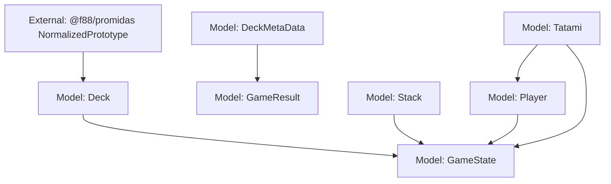

# pp-karuta Design Document

## Overview

pp-karutaは、ProtoPediaのプロトタイプデータを活用したカルタゲームアプリケーションです。

## STYLING

- Shared theme: Use shadcn/ui + Tailwind CSS variables (defined in src/index.css) for all pages by default.
- Intro page theme: /intro is intentionally isolated and must use its own Matrix-style theme from src/components/intro/IntroPage.css.
- Rule: Do not “normalize” /intro to the shared theme. The Intro route should avoid the shared ThemeProvider and should enforce its theme via a dedicated body class.

## Data Source

### ProtoPedia API v2 and PROMIDAS

- [ProtoPedia API v2 Response型定義](https://raw.githubusercontent.com/F88/protopedia-api-v2-client.js/af40cfdba1908a7a21f0576859b0e1907d337b81/src/types/protopedia-api-v2/response.ts)
- [PROMIDAS normalizePrototype](https://raw.githubusercontent.com/F88/promidas/dd64e5a20ebe562e35e7eb032326e5d0faf7f315/lib/fetcher/utils/normalize-prototype.ts)

### What is Karuta?

カルタは日本の伝統的なカードゲームです。

#### 道具

- **文字札・読み札(yomifuda)**: 取り札の内容を書いた短い文章が書かれており、読み手が声に出して読む
- **絵札・取り札(torifuda)**: 読み札の内容を描いた絵と、読み札の文言の頭文字がひらがなで書かれている

伝統的なかるたでは、あいうえお46枚ずつの札があり、一音につき一セットの読み札・取り札が用意されています。

#### 基本ルール

1. 2人以上で行う
2. 取り札を平面に広げ、取る人に見やすくする
3. 読み人が読み札を読む
4. できるだけ早く、読み札に合った取り札を取る(または叩く)
5. 全ての札がなくなるまで繰り返す
6. より多くの取り札を取った方の勝ち

参考: [Karuta - Wikipedia](https://en.wikipedia.org/wiki/Karuta)

### PROMIDAS Integration

- [PROMIDAS](https://github.com/F88/promidas)を使用してProtoPedia API v2からプロトタイプデータを取得
- 取得したプロトタイプを「札(カード)」として使用
- 100件のプロトタイプをキャッシュし、ゲーム中に利用

## Game Rules

### pp-karuta の基本ルール

伝統的なかるたのルールをProtoPediaのプロトタイプデータに適用します。

#### 札の構成

##### YomiFuda(読み札・文字札)

- ProtoPedia API から取得したプロトタイプの説明文(description)または概要
- 画面上部に表示される
- 1枚ずつ順番に表示

##### ToriFuda(取り札・絵札)

- ProtoPedia API から取得したプロトタイプの画像(サムネイル)
- プロトタイプのタイトル
- `prototypeId` を持ち、YomiFuda との対応関係を判定できる
- 複数枚が「Tatami(畳)」エリアに配置される

##### 札の枚数

- 伝統的なかるたの46枚制限はなし
- ProtoPedia API から取得できる範囲で任意の枚数を使用可能

#### ゲームの流れ

##### Phase 0: 入力方式選択 (タイトル画面)

###### 入力方式選択

- **Keyboard**: ショートカットキーで操作 (PC環境)
    - 共通のTatamiエリアを使用
    - 各プレイヤーに専用のキーバインドを割り当て
        - Player 1: 1, 2, 3, 4, 5
        - Player 2: Q, W, E, R, T
        - Player 3: A, S, D, F, G
        - Player 4: Z, X, C, V, B
- **Touch**: タップで操作 (モバイル/タッチ環境)
    - 各プレイヤーに専用のTatamiエリアを表示
    - プレイヤーは自分のエリアのみタップ可能
    - 画面レイアウトはプレイヤー数に応じて分割

この選択により後続の画面レイアウトが確定する

##### Phase 1: プレイヤー人数選択

###### プレイヤー人数選択

- 1人〜4人から選択
- Touchモードの場合、選択した人数により画面分割が決定
    - 1人: 全画面
    - 2人: 上下または左右分割
    - 3-4人: グリッド分割

##### Phase 2: BOX選択

###### BOX一覧表示

- 利用可能なBOXを表示
- 各BOXには以下の仕様が定義されている:
    - データフィルタ条件 (タグ、年代など)
    - 札の枚数
    - 難易度設定
    - タイムリミット (オプション)

###### BOX選択

- プレイヤーが任意のBOXを選択
- 選択されたBOX仕様に基づいてYomiFuda/ToriFudaを生成

##### Phase 3: ゲーム初期化

###### データ準備

1. PROMIDASから選択されたBOX仕様に合致するPrototypeDataを取得
2. PrototypeDataからYomiFuda と ToriFudaを生成
    - 両者は `prototypeId` で対応関係を持つ
3. YomiFudaの順序をシャッフル (またはBOX仕様に従う)
4. **ToriFuda Stack の初期化**
    - すべてのToriFudaをシャッフル
    - 配列としてStackを保持 (例: `toriFudaStack = shuffle(allToriFudas)`)
5. **初期Tatami配置**
    - Stackから最初の5枚をpopしてTatamiに配置

###### ゲーム状態初期化

- 現在のRace = 1
- 総Race数 = YomiFudaの枚数
- 各プレイヤーのMochiFuda = []
- ToriFuda Stack (残りのToriFuda)
- Tatami (表示中の5枚のToriFuda)
- タイマー開始

##### Phase 4: ゲームプレイ (Race進行)

`1 Game = (YomiFuda数 = ToriFuda数) x Race`

###### 1 Raceの定義

1 Race = YomiFudaが表示されてから対応するToriFudaが取られるまで

###### Race開始

1. 現在のYomiFudaを表示
2. Tatamiには既に配置済みのToriFudaが表示されている
    - Tatami上のToriFudaの中に正解(currentYomiFudaに対応するToriFuda)が含まれる
    - 正解が含まれない場合: 現在のYomiFudaはスキップ (該当札なし)
    - 各ToriFudaに番号を表示 (1-5, またはTatami上の枚数に応じて)

###### プレイヤーアクション(早い者勝ち)

- 全プレイヤーが同時に入力可能
- Keyboard入力:
    - 共通のTatamiに対して各プレイヤーが割り当てられたキーで入力
- Touch入力:
    - 各プレイヤー専用のTatamiエリア (同じToriFudaを表示)
    - 自分のエリアをタップして選択

###### 判定

- 最初に正解のToriFudaを選択したプレイヤーが獲得
- **正解時**:
    1. そのプレイヤーのMochiFudaに追加
    2. 正解のToriFudaをTatamiから除去
    3. **Stackに札が残っている場合**: Stack.shift() で1枚取り出してTatamiに追加
    4. **Stackが空の場合**: Tatamiに追加せず (Tatamiの札は徐々に減っていく)
    5. スコア加算
    6. 次のRaceへ進む
- **不正解時**:
    1. ペナルティ (スコア減算など)
    2. そのプレイヤーは引き続き選択可能
    3. 誰かが正解するまで継続

###### Race終了条件

- いずれかのプレイヤーが正解のToriFudaを取得

###### ゲーム終盤の挙動

- Stackが空になった後もゲームは継続
- Tatami上の札は取られるたびに減っていく
- 最後のYomiFudaに対応するToriFudaが取られた時点でゲーム終了

##### Phase 5: ゲーム終了

###### 終了条件

- すべてのYomiFuda/ToriFudaペアがなくなる
- または制限時間終了 (BOX仕様による)

###### 結果表示

- 各プレイヤーの獲得枚数
- スコア
- プレイ時間

### プレイヤー人数

- **1人**: シングルプレイ (タイムアタック、完走モード)
- **2-4人**: マルチプレイヤー (早い者勝ち)

各プレイヤーは獲得したToriFudaを自分のMochiFudaに保持し、最終的に最も多くの札を獲得したプレイヤーが勝利。

### 入力方式

- **Keyboard**: PC環境向け、ショートカットキーで操作
- **Touch**: モバイル/タブレット環境向け、タップで操作

### 勝利条件

- 最も多くの札を取ったプレイヤーが勝利
- シングルプレイの場合: スコアとタイムを記録

### 画面遷移フロー

```text
1. タイトル画面
   - アプリタイトル
   - 入力方式選択 (Keyboard / Touch)
   ↓ (入力方式決定)

2. プレイヤー人数選択画面
   - プレイヤー人数選択 (1-4人)
   - (Touch時: 画面分割プレビュー表示)
   ↓ (次へ)

3. BOX選択画面
   - 利用可能なBOX一覧表示
   - BOX選択
   ↓ (ゲーム開始)

4. ゲーム画面
   - YomiFuda表示エリア (共通)
   - Tatamiエリア (5枚のToriFuda)
     * Keyboard: 共通エリア
     * Touch: 各プレイヤー専用エリア
   - MochiFudaエリア (各プレイヤー)
   - スコア/タイマー表示
   ↓ (全Race終了)

5. 結果画面
   - 各プレイヤーのスコア
   - 獲得枚数ランキング
   - プレイ時間
   - リプレイ/タイトルへ戻る
```

## Screen Design

### 1. タイトル画面

- アプリタイトル (PP Karuta)
- 入力方式選択:
    - [Keyboard] ボタン (PC環境向け)
    - [Touch] ボタン (モバイル/タブレット向け)
- ルール説明へのリンク
- PROMIDAS統計情報(オプション)

この画面で入力方式を決定することで、以降の画面レイアウトが確定する

### 2. プレイヤー人数選択画面

#### プレイヤー人数選択(UI)

- [1人] [2人] [3人] [4人] ボタン

#### Touchモードの場合

- 選択した人数に応じた画面分割プレビューを表示
- 例: 2人選択時 → 上下分割のプレビュー

#### 次へボタン

### 3. BOX選択画面

#### BOX一覧

- 利用可能なBOXをカード形式で表示
- 各BOXに表示する情報:
    - BOX名
    - 説明
    - 札の枚数
    - 難易度
    - タイムリミット (あれば)

#### BOX選択(UI)

- クリック/タップでBOXを選択
- ゲーム開始ボタン

### 4. ゲーム画面

**Keyboardモードのレイアウト:**

```text
┌─────────────────────────────────────┐
│  YomiFuda表示エリア (共通)        │
│  「このプロトタイプは...」            │
├─────────────────────────────────────┤
│  Tatamiエリア (共通, 5枚)          │
│  [1] [2] [3] [4] [5]                │
│  札A 札B 札C 札D 札E                │
├─────────────────────────────────────┤
│  プレイヤー情報エリア              │
│  P1: 3枚 | P2: 5枚 | P3: 2枚      │
│  スコア | タイマー | 進行状況      │
└─────────────────────────────────────┘
```

**Touchモードのレイアウト (2人の例):**

```text
┌─────────────────────────────────────┐
│  YomiFuda表示エリア (共通)        │
├───────────────────┬──────────────────┤
│ Player 1 Tatami   │ Player 2 Tatami   │
│ [1][2][3][4][5]   │ [1][2][3][4][5]   │
│ MochiFuda: 3枚    │ MochiFuda: 5枚    │
└───────────────────┴──────────────────┘
```

**コンポーネント:**

- YomiFuda表示エリア (上部、全プレイヤー共通)
- Tatamiエリア (5枚のToriFudaを表示)
    - Keyboard: 1つの共通エリア
    - Touch: プレイヤー数分のエリア (同じToriFudaを表示)
- MochiFudaエリア (各プレイヤーの獲得札)
- 情報表示エリア (スコア/タイマー/進行状況)

### 5. 結果画面

- 各プレイヤーの最終スコア
- 獲得枚数ランキング
- プレイ時間
- リプレイボタン
- タイトルへ戻るボタン

## Data Model

このプロジェクトでは、型定義や実データ構造は実装が正です(= DESIGN.mdに重複定義しない)。

- Karuta domain models: src/models/karuta/
- Deck/recipe generation: src/lib/karuta/
- ProtoPedia API integration: src/lib/repository/ と src/lib/karuta/api-data.ts

### Model Dependencies

型の詳細(フィールド定義)はコードを参照し、DESIGN.mdでは「依存関係」だけを維持する。



ルール(メンテコストを増やさないための方針):

- DESIGN.mdは依存グラフと意図のみを書く(型の全文は書かない)
- 依存グラフは概念的な依存(所有/参照/生成)を表す(必ずしもTSのimportに一致しない)
- modelsはUIやrepositoryに依存しない(逆方向にしない)

DESIGN.mdには「設計判断」「制約」「意図」だけを書く(実装の詳細は書かない)。

## Component Architecture

### Container/Presentational Pattern

すべてのコンポーネントは以下のパターンに従う:

- **Container**: データ取得、状態管理、ビジネスロジック
- **Presentational**: UIレンダリング、propsを受け取って表示のみ

### Routing

- TanStack Routerを使用し、URLでの直接アクセス(例: /intro)を可能にする
- GitHub Pages配下(/pp-karuta)で動くようにbasepathを設定する(src/main.tsx)

### Notes

- Tech StackはREADME.mdのTech Stackを正とする

## References

- [Karuta - Wikipedia](https://en.wikipedia.org/wiki/Karuta)
- [PROMIDAS](https://github.com/F88/promidas)
- [PROMIDAS Utilities](https://github.com/F88/promidas-utils)
- [ProtoPedia](https://protopedia.net/)
