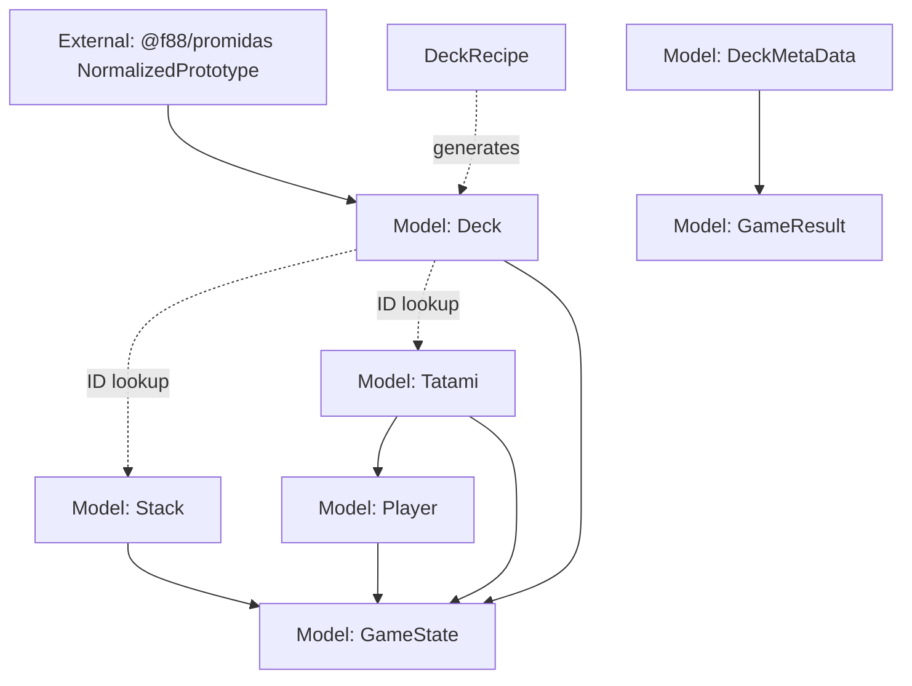

# pp-karuta Design Document

## Overview

pp-karutaは、ProtoPediaのプロトタイプデータを活用したカルタゲームアプリケーションです。

## STYLING

- Shared theme: Use shadcn/ui + Tailwind CSS variables (defined in src/index.css) for all pages by default.
- Intro page theme: /intro is intentionally isolated and must use its own Matrix-style theme from src/components/intro/IntroPage.css.
- Rule: Do not “normalize” /intro to the shared theme. The Intro route should avoid the shared ThemeProvider and should enforce its theme via a dedicated body class.

## Data Source

### ProtoPedia API v2 and PROMIDAS

- [ProtoPedia API v2 Response型定義](https://raw.githubusercontent.com/F88/protopedia-api-v2-client.js/af40cfdba1908a7a21f0576859b0e1907d337b81/src/types/protopedia-api-v2/response.ts)
- [PROMIDAS normalizePrototype](https://raw.githubusercontent.com/F88/promidas/dd64e5a20ebe562e35e7eb032326e5d0faf7f315/lib/fetcher/utils/normalize-prototype.ts)

### What is Karuta?

カルタは日本の伝統的なカードゲームです。

#### 道具

- **文字札・読み札(yomifuda)**: 取り札の内容を書いた短い文章が書かれており、読み手が声に出して読む
- **絵札・取り札(torifuda)**: 読み札の内容を描いた絵と、読み札の文言の頭文字がひらがなで書かれている

伝統的なかるたでは、あいうえお46枚ずつの札があり、一音につき一セットの読み札・取り札が用意されています。

#### 基本ルール

1. 2人以上で行う
2. 取り札を平面に広げ、取る人に見やすくする
3. 読み人が読み札を読む
4. できるだけ早く、読み札に合った取り札を取る(または叩く)
5. 全ての札がなくなるまで繰り返す
6. より多くの取り札を取った方の勝ち

参考: [Karuta - Wikipedia](https://en.wikipedia.org/wiki/Karuta)

### PROMIDAS Integration

- [PROMIDAS](https://github.com/F88/promidas)を使用してProtoPedia API v2からプロトタイプデータを取得
- `ProtopediaInMemoryRepository`でsnapshotとしてデータをキャッシュ
- 取得したプロトタイプを「札(カード)」として使用

## Game Rules

### pp-karuta の基本ルール

伝統的なかるたのルールをProtoPediaのプロトタイプデータに適用します。

#### 札の構成

##### YomiFuda(読み札・文字札)

- ProtoPedia API から取得したプロトタイプの説明文(description)または概要
- 画面上部に表示される
- 1枚ずつ順番に表示

##### ToriFuda(取り札・絵札)

- ProtoPedia API から取得したプロトタイプの画像(サムネイル)
- プロトタイプのタイトル
- `prototypeId` を持ち、YomiFuda との対応関係を判定できる
- 複数枚が「Tatami(畳)」エリアに配置される

##### 札の枚数

- 伝統的なかるたの46枚制限はなし
- ProtoPedia API から取得できる範囲で任意の枚数を使用可能

#### ゲームプレイの流れ

##### ゲーム開始時の状態

- YomiFudaが出題順序で準備されている
- Tatami上に複数枚のToriFudaが配置されている（初期枚数は設定により変動）
- 各プレイヤーのMochiFuda（獲得札）は空
- 残りのToriFudaはStackとして保持

##### Race進行

**1 Race = YomiFudaが表示されてから対応するToriFudaが取られるまで**

1ゲームは複数のRaceで構成され、`1 Game = YomiFuda枚数分のRace`

###### Race開始

1. 現在のYomiFudaを表示
2. Tatamiには既に配置済みのToriFudaが表示されている
    - Tatami上のToriFudaの中に正解(currentYomiFudaに対応するToriFuda)が含まれる
    - 正解が含まれない場合: 現在のYomiFudaはスキップ (該当札なし)
    - 各ToriFudaに番号を表示 (1-5, またはTatami上の枚数に応じて)

###### プレイヤーアクション

- 全プレイヤーが同時に入力可能（早い者勝ち）
- 入力方式により操作方法が異なる:
    - **Keyboard**: 各プレイヤーに割り当てられたキーで札を選択 *[未実装]*
    - **Touch**: 各プレイヤー専用のTatamiエリアをタップ *[未実装]*
    - **現在**: クリック操作のみサポート

###### 判定

- 最初に正解のToriFudaを選択したプレイヤーが獲得
- **正解時**:
    1. そのプレイヤーのMochiFudaに追加
    2. 正解のToriFudaをTatamiから除去
    3. **Stackに札が残っている場合**: Stack.shift() で1枚取り出してTatamiに追加
    4. **Stackが空の場合**: Tatamiに追加せず (Tatamiの札は徐々に減っていく)
    5. スコア加算
    6. 次のRaceへ進む
- **不正解時**:
    1. ペナルティ (スコア減算など)
    2. そのプレイヤーは引き続き選択可能
    3. 誰かが正解するまで継続

###### Race終了条件

- いずれかのプレイヤーが正解のToriFudaを取得

###### ゲーム終盤の挙動

- Stackが空になった後もゲームは継続
- Tatami上の札は取られるたびに減っていく
- 最後のYomiFudaに対応するToriFudaが取られた時点でゲーム終了

##### ゲーム終了

###### 終了条件

- すべてのYomiFuda/ToriFudaペアが処理された時点で終了
- （将来的に）制限時間がある場合は時間切れでも終了

###### 結果

- 各プレイヤーの獲得枚数をランキング表示
- 最も多くの札を取ったプレイヤーが勝利
- シングルプレイの場合: スコアとタイムを記録

### プレイヤー人数

- **1人**: シングルプレイ
- **2-4人**: マルチプレイヤー

各プレイヤーは獲得したToriFudaを自分のMochiFudaに保持し、最終的に最も多くの札を獲得したプレイヤーが勝利。

### 入力方式 *[未実装]*

#### Keyboard Mode

- PC環境向け、ショートカットキーで操作
- 共通のTatamiエリアを使用
- 各プレイヤーに専用のキーバインドを割り当て:
    - **Player 1**: 1, 2, 3, 4, 5
    - **Player 2**: Q, W, E, R, T
    - **Player 3**: A, S, D, F, G
    - **Player 4**: Z, X, C, V, B
- 各キーがTatami上の札の位置に対応

#### Touch Mode

- モバイル/タブレット環境向け、タップで操作
- 各プレイヤーに専用のTatamiエリアを表示（同じToriFudaを表示）
- プレイヤーは自分のエリアのみタップ可能
- 画面レイアウトはプレイヤー数に応じて分割:
    - 1人: 全画面
    - 2人: 上下または左右分割
    - 3-4人: グリッド分割

#### 現在の実装

- クリック操作のみサポート
- Keyboard/Touchモードは未実装

### 勝利条件

- 最も多くの札を取ったプレイヤーが勝利
- シングルプレイの場合: スコアとタイムを記録

## Screen Design

### 画面遷移フロー

```text
1. Intro画面 (/intro)
   - Matrix風演出
   - PP Karuta紹介
   - ゲーム開始ボタン
   ↓

2. 統合セレクター画面 (/)
   - PlayMode選択 (Keyboard/Touch) *[未実装]*
   - Players選択 (1-4人、名前設定)
   - DeckRecipe選択 (データソース)
   - StackRecipe選択 (抽出件数・ソート方法)
   - 選択状態サマリー表示
   - Deck/Stack生成状態表示
   - ゲーム開始ボタン
   ↓

3. ゲーム画面
   - YomiFuda表示エリア (上部、共通)
   - Tatamiエリア (ToriFudaを表示)
   - MochiFudaエリア (各プレイヤー)
   - 進行状況表示
   ↓

4. 結果画面
   - 各プレイヤーの獲得枚数
   - ランキング表示
   - Replayボタン (同じ設定で再開始)
   - Back to Topボタン (統合セレクターへ、設定保持)
```

### 1. Intro画面

- Matrix風のアニメーション演出
- PP Karutaの紹介テキスト
- 「ゲームを始める」ボタン
- 独立したテーマ（ThemeProviderを使用しない）

### 2. 統合セレクター画面

#### レイアウト

2x2グリッドで4つの選択エリアを同時表示:

1. **PlayMode選択** *[未実装]*
   - Keyboard / Touch の選択カード
   - 選択された入力方式をハイライト

2. **Players選択**
   - プレイヤー数選択 (1-4人)
   - 各プレイヤーの名前入力
   - プレイヤーカード表示

3. **DeckRecipe選択**
   - 利用可能なDeckRecipeをカード形式で表示
   - 各カードには以下を表示:
     - タイトル、説明
     - 難易度、タグ
   - 選択時にDeck生成開始

4. **StackRecipe選択**
   - 利用可能なStackRecipeをカード形式で表示
   - 各カードには以下を表示:
     - タイトル、説明
     - 抽出件数、ソート方法
     - 難易度、タグ
   - 選択時にStack生成開始

#### 選択状態サマリー

- 現在の選択状態を一覧表示
- Deck生成状態: 「✓ Deck生成完了: {size}枚」
- Stack生成状態: 「✓ Stack生成完了: {length}枚」
- 全選択完了時にゲーム開始ボタンを有効化

### 3. ゲーム画面

**Keyboardモードのレイアウト:**

```text
┌─────────────────────────────────────┐
│  YomiFuda表示エリア (共通)        │
│  「このプロトタイプは...」            │
├─────────────────────────────────────┤
│  Tatamiエリア (共通, 5枚)          │
│  [1] [2] [3] [4] [5]                │
│  札A 札B 札C 札D 札E                │
├─────────────────────────────────────┤
│  プレイヤー情報エリア              │
│  P1: 3枚 | P2: 5枚 | P3: 2枚      │
│  スコア | タイマー | 進行状況      │
└─────────────────────────────────────┘
```

**Touchモードのレイアウト (2人の例):**

```text
┌─────────────────────────────────────┐
│  YomiFuda表示エリア (共通)        │
├───────────────────┬──────────────────┤
│ Player 1 Tatami   │ Player 2 Tatami   │
│ [1][2][3][4][5]   │ [1][2][3][4][5]   │
│ MochiFuda: 3枚    │ MochiFuda: 5枚    │
└───────────────────┴──────────────────┘
```

**コンポーネント:**

- YomiFuda表示エリア (上部、全プレイヤー共通)
- Tatamiエリア (5枚のToriFudaを表示)
    - Keyboard: 1つの共通エリア
    - Touch: プレイヤー数分のエリア (同じToriFudaを表示)
- MochiFudaエリア (各プレイヤーの獲得札)
- 情報表示エリア (スコア/タイマー/進行状況)

### 4. 結果画面

#### 表示内容

- 各プレイヤーの獲得枚数
- ランキング表示（獲得枚数順）
- 勝者の強調表示

#### アクション

- **Replayボタン**:
    - 同じゲーム設定（Players/DeckRecipe/StackRecipe）で即座にゲーム再開始
    - 統合セレクターを経由せず、直接ゲーム画面へ遷移
    - Deck/Stackは再利用（再生成しない）

- **Back to Topボタン**:
    - 統合セレクター画面へ戻る
    - 現在の選択状態を保持（変更可能）
    - Deck/Stack生成状態も保持

## Data Model

このプロジェクトでは、型定義や実データ構造は実装が正です(= DESIGN.mdに重複定義しない)。

- Karuta domain models: src/models/karuta/
- Deck/recipe generation: src/lib/karuta/
- ProtoPedia API integration: src/lib/repository/ と src/lib/karuta/api-data.ts

### Model Dependencies

#### モデル概要

- **DeckRecipe**: Deck 生成の設計図（プリセット定義）
    - 役割:
        1. `setupSnapshot` に対する `ListPrototypesParams` (既存の型) を規定
        2. 必要に応じて `setupSnapshot` の結果に対する追加フィルタリング機能を提供
    - 主要: `ListPrototypesParams` (データ取得条件), 追加フィルタ条件
    - メタデータ: `title`, `description`, `difficulty`, `tags` (UI表示用)
    - 実装: `src/lib/karuta/recipe/definitions.ts`

```typescript
// 例1: 基本形 - offset と limit のみ指定
ListPrototypesParams(offset: 0, limit: 10_000)
// 追加フィルタ: なし

// 例2: ID 配列による追加フィルタ
ListPrototypesParams(offset: 0, limit: 10_000)
// 追加フィルタ: ID の配列によるフィルタリングを行う
// 用途: 特定のキュレーション済みプロトタイプセットを使用

// 例3: タグ名によるAPI側フィルタ
ListPrototypesParams(offset: 0, limit: 10_000, tagNm: tagName)
// 追加フィルタ: なし
// 用途: 特定タグのプロトタイプのみでゲームを構成
```

- **Deck**: Prototype データの大きなプール
    - 構造: `Map<prototypeId, NormalizedPrototype>`
    - 特性: 不変、O(1)アクセス
    - サイズ: `setupSnapshot` の結果とフィルタリング結果で決まる (例: 1000件)
    - 生成: DeckRecipe と Prototype 配列から `generateDeck()` で生成
    - 実装: `src/models/karuta/deck.ts`

- **StackRecipe**: Stack 生成の設計図
    - 役割: Deck から何件のIDを抽出し、どのようにソートするかを規定
    - 主要: `maxSize` (抽出件数、`"all"` または数値), `sortMethod` (ソート方法)
    - メタデータ: `title`, `description`, `difficulty`, `tags` (UI表示用)
    - プリセット: 5件、10件、30件、全件
    - 実装: `src/lib/karuta/recipe/definitions.ts`

- **Stack**: Deck から抽出されたデータのID配列
    - 構造: `number[]` (Deck の ID の部分配列)
    - 関係: StackRecipe に基づいて Deck から抽出し、ランダムにソート
    - サイズ: StackRecipe の `maxSize` で指定 (例: 5, 10, 30 or "all")
    - 例: Deck が 1000件 → Stack は 10件
    - 特性: 不変 (ゲーム中の Stack は GameState.stack として別管理)
    - 実装: `src/models/karuta/stack.ts`

- **Tatami**: 場に出ているカード
    - 構造: `number[]` (Deck の ID 配列、最初は5枚)
    - 関係: **Stack から取り出された ID**
    - 初期: `Stack.slice(0, 5)`
    - 更新: カード取得時、Stack から補充（Stack枯渇後は補充なし）
    - 実装: `src/models/karuta/tatami.ts`

- **GameState**: ゲーム全体の状態
    - 所有: Deck, Stack, Tatami, Players
    - 実装: `src/models/karuta/game.ts`

#### データフロー

```
DeckRecipe (ListPrototypesParams, filter?)
  ↓ setupSnapshot(ListPrototypesParams)
API取得結果 (NormalizedPrototype[])
  ↓ filter? (必要に応じて追加フィルタリング)
Prototype配列 (例: 1000件)
  ↓ generateDeck(recipe, prototypes)
Deck (Map<ID, NormalizedPrototype>: 大きなデータプール、例: 1000件)

StackRecipe (maxSize, sortMethod)
  ↓ generateStack(stackRecipe, deck)
Stack (number[]: Deckから抽出されたID配列、例: 10件)
```

#### 設計判断

**DeckRecipe と Deck の分離**

- DeckRecipe: 再利用可能な設計図（データ取得条件を規定）
- Deck: DeckRecipe から生成されたデータプール
- 理由: 同じ DeckRecipe から異なる Deck を繰り返し生成可能

**DeckRecipe がデータ取得条件を決定**

- DeckRecipe は `ListPrototypesParams` (既存の型) と追加フィルタを規定
- 理由: ゲームモードごとに異なるデータセットが必要（例: 特定タグのみ、キュレーション済みセット）
- 利点: データ取得ロジックを DeckRecipe に集約し、ゲームモードの追加・変更が容易

**StackRecipe と Stack の分離**

- StackRecipe: Stack 生成の設計図（抽出件数とソート方法を規定）
- Stack: StackRecipe に基づいて Deck から生成されたID配列
- 理由: 同じ Deck から異なる StackRecipe で複数の Stack を生成可能

**Deck と Stack の分離**

- Deck: 大きなデータプール（不変、Map構造、例: 1000件）
- Stack: Deck から抽出されたID配列（不変、例: 5~30件）
- 理由:
    - Deck を大きく保つことで、同じ Deck から異なるサイズの Stack を複数生成可能
    - データ本体 (Deck) と順序管理 (Stack) の関心分離、メモリ効率
    - プレイヤーは stackSize のプリセット (5, 10, 30) または任意件数を選択可能

**ID 配列の採用 (Stack/Tatami)**

- Stack/Tatami は prototype ID のみ保持
- Deck が唯一のデータソース
- 理由: メモリ効率、データ整合性、配列操作の軽量化

#### 依存関係図



**ルール（メンテコストを増やさないための方針）:**

- DESIGN.mdは依存グラフと意図のみを書く（型の全文は書かない）
- 依存グラフは概念的な依存（所有/参照/生成）を表す（必ずしもTSのimportに一致しない）
- modelsはUIやrepositoryに依存しない（逆方向にしない）

DESIGN.mdには「設計判断」「制約」「意図」だけを書く（実装の詳細は書かない）。

## Component Architecture

### Container/Presentational Pattern

すべてのコンポーネントは以下のパターンに従う:

- **Container**: データ取得、状態管理、ビジネスロジック
- **Presentational**: UIレンダリング、propsを受け取って表示のみ

### Routing

- TanStack Routerを使用し、URLでの直接アクセス(例: /intro)を可能にする
- GitHub Pages配下(/pp-karuta)で動くようにbasepathを設定する(src/main.tsx)

### Notes

- Tech StackはREADME.mdのTech Stackを正とする

## References

- [Karuta - Wikipedia](https://en.wikipedia.org/wiki/Karuta)
- [PROMIDAS](https://github.com/F88/promidas)
- [PROMIDAS Utilities](https://github.com/F88/promidas-utils)
- [ProtoPedia](https://protopedia.net/)
